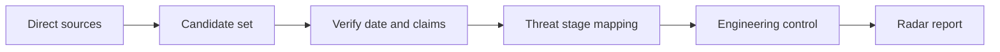

# Agent Security Radar

A practical research radar for turning agent-security papers and incidents into engineering controls.

## Scope

The radar tracks risks created when AI agents can read untrusted content, call tools, retain memory, coordinate with other agents, or take actions in external systems.

| Area | Questions |
|---|---|
| Prompt injection | Can untrusted content redirect the agent? |
| Tool use | Is every capability scoped, authorized, and auditable? |
| Memory and retrieval | Can poisoned or sensitive context persist? |
| Multi-agent systems | Can authority or misinformation propagate between agents? |
| Data security | Can secrets cross an unintended boundary? |
| Execution safety | Does uncertainty stop real-world actions? |

## Research workflow



Each included item should answer:

1. What new capability or failure mode is demonstrated?
2. Which stage of the agent lifecycle is affected?
3. What evidence supports the claim?
4. What can an engineering team change now?
5. What remains unknown?

## Lifecycle model

```text
Input → Context → Planning → Tool selection → Authorization
      → Execution → External state → Reconciliation → Memory
```

A report should map findings to one or more stages instead of using “agent safety” as a single undifferentiated category.

## Editorial rules

- Prefer papers, advisories, repositories, and incident reports from direct sources.
- Separate verified facts, interpretation, and unknowns.
- Avoid treating benchmark performance as production safety.
- Record publication date and event date separately when they differ.
- Link every recommended control to a concrete risk.
- Keep real-world actions fail-closed when authorization or external state is uncertain.

## Repository structure

- `docs/risk-taxonomy.md` — threat and control taxonomy
- `templates/radar-report.md` — reusable daily/weekly report format
- `SECURITY.md` — responsible disclosure and sensitive-data boundary

## Status

The public taxonomy and report format are available now. Reviewed radar entries will be added incrementally.